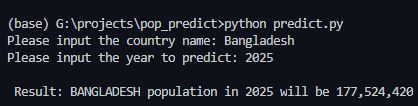

This script is a simple linear regression model which
will predict population of a country. It will consider user input for a country (depends on availability)

The population data was collected from https://data.worldbank.org/indicator/SP.POP.TOTL

Also, all the countries available are given as a json file in country_list file.

User Input:

    country: name of the country to be predicted
    year: the year to be predicted

Below is a sample output given:

